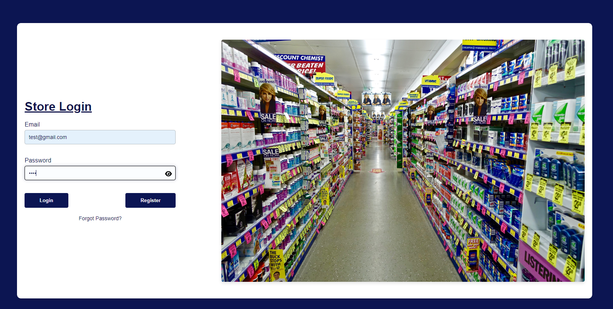
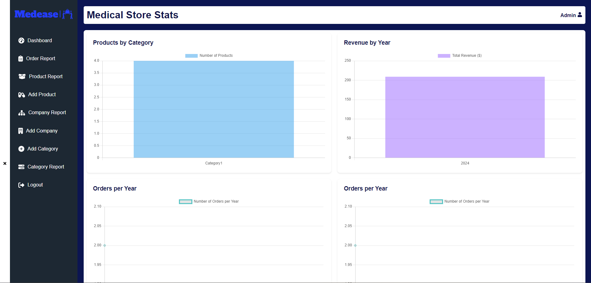
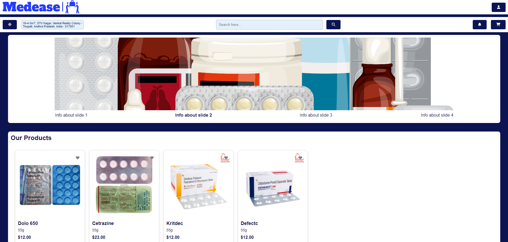

<p align="center"> 
    </img>
</p>

<h1 align="center"> MedEase 🏥🌐</h1> 
<h3 align="center"> Streamlining medical store operations with efficient inventory, sales, and customer management.</h3>

<p align="center">
    <a href="https://reactjs.org/"></a>
    <a href="https://sass-lang.com/"></a>
    <a href="https://vitejs.dev/"></a>
    <a href="https://redux.js.org/"></a>
    <a href="https://spring.io/projects/spring-boot"></a>
    <a href="https://hibernate.org/"></a>
    <a href="https://spring.io/projects/spring-data-jpa"></a>
    <a href="https://dev.mysql.com/doc/connector-j/8.0/en/"></a>
    <a href="https://jwt.io/"></a>
    <a href="https://aws.amazon.com/sdk-for-java/"></a>
</p>

## Features

- **Inventory Management**: Add, update, and delete products from the inventory.
- **Order Management**: Add, update, and delete orders.
- **Company Management**: Add, update, and delete company data.
- **Product Category Management**: Add, update, and delete category data.
- **Customer Management**: Add, update, and delete customer data.
- **Dashboard**: View sales and inventory statistics.

## Technology Stack

### Frontend Technologies

- **React**: A JavaScript library for building user interfaces, enabling the development of single-page applications with interactive UIs.
- **SCSS/Sass**: A preprocessor scripting language that is interpreted or compiled into CSS, enhancing the styling process with variables, nested rules, and more.
- **Vite**: A modern frontend build tool that significantly improves the development experience with fast cold starts and instant hot module replacement (HMR).
- **Axios**: A promise-based HTTP client for the browser and node.js, used for making API requests.
- **Chart.js and react-chartjs-2**: JavaScript libraries for displaying interactive charts and graphs.
- **html2canvas and jspdf**: Libraries used for generating PDFs from web pages, allowing users to download reports or receipts.
- **React Hot Toast**: Provides lightweight, customizable notifications for React applications.
- **React Icons**: Includes an assortment of popular icons for easy use in React projects.
- **Redux and React Redux**: A state management library and its official React bindings, respectively, used for managing application state more efficiently.
- **React Router Dom**: Enables dynamic routing in React applications, allowing for the development of single-page applications with navigation without page refreshes.
- **FontAwesome**: A popular icon set and toolkit used for adding vector icons and social logos to the website.

### Backend Technologies

- **Spring Boot**: Simplifies the development of new Spring applications with convention over configuration, providing a range of out-of-the-box functionalities for web development.
- **Spring Boot DevTools**: Provides fast application restarts, LiveReload, and configurations for enhanced development experience.
- **Spring Boot Starter Test**: Supports testing Spring Boot applications with libraries including JUnit, Hamcrest, and Mockito.
- **Spring Boot Starter Data JPA**: Configures Spring Data JPA to simplify the implementation of data access layers.
- **Spring Boot Starter Security**: Offers authentication and authorization features to secure Spring applications.
- **Spring Boot Starter Validation**: Provides support for validating Spring applications using Java Bean Validation APIs.
- **MySQL Connector/J**: A JDBC driver for MySQL, facilitating database connections and operations.
- **Lombok**: A Java library that automatically plugs into your editor and build tools, spicing up your java. Never write another getter or equals method again.
- **JSON Web Tokens (JWT)**: Used for securely transmitting information between parties as a JSON object, with `jjwt-api`, `jjwt-impl`, and `jjwt-jackson` for implementation and integration.
- **Spring Boot Starter Actuator**: Provides production-ready features to help monitor and manage the application.
- **AWS Java SDK for S3**: Enables the application to interact with Amazon S3, for operations like uploading and managing files in S3 buckets.
- **Jakarta XML Bind API and JAXB Runtime**: Libraries used for converting Java objects to XML and vice versa.

## Installation

1. Clone the repository
   ```sh
   git clone https://github.com/charangajjala/medEase_portal.git
   ```
2. Navigate to the project directory
3. Install the required dependencies
   ```sh
   npm install
   ```
4. Start the development server
   ```sh
    npm run dev
   ```
5. By default the application opens at the port 5173 but it can be altered in the `vite.config.js` file. If the port is changed, the backend URL in the `./backend/src/main/java/com/chapp/med_ease/config/WebConfig.java` file should also be updated by changing the `allowedOrigins` value.
6. After initiating the frontend side, we should also start the backend server. The backend server is a Spring Boot application and can be started by running the `MedEaseApplication.java` file in the `./backend/src/main/java/com/chapp/med_ease` directory.
7. By default frontend application uses the default backend URL `http://localhost:8080` but it can be altered in the `./frontend/src/api/axios.jsx` file.
8. After a successful build, we need to make sure the database is up and running. The database schema is provided in the `./backend/src/main/resources` directory. The database configuration can be altered in the `./backend/src/main/resources/application.properties` file.

## Usage

The application is designed to be user-friendly and intuitive. Both the admin and user have a common login page. The admin credentials can be added to the database manually. The admin has access to all the features of the application which includes

- Inventory Management
- Order Management
- Company Management
- Product Category Management
- Statistics of the sales and inventory

The user has access to the shopping page where they can perform operations like

- Viewing products
- Adding products to the cart
- Placing orders
- Viewing order history
- Viewing seller and company details (Under development)
- Searching for products
- Viewing product categories
- Adding and updating customer details

Other features like loading animations and notifications are also included in the application. Most of the features are self-explanatory and application is desgned to be user-friendly.

Apart from this the application is made responsive and can be accessed from any device. But it is recommended to use the application on a desktop for a better experience. The applicatioon is also designed to be secure and the user data is encrypted and stored in the database. The application is also designed to be scalable and can be easily extended to include more features.

## How it works

### Database Schema


This schema is designed to include the seller feature which is under development. This is getting carried on as a part of the future work. Currently the application has the admin and user features.

### Authentication

The application currently uses Role based login and JWT for authentication. The application has two types of users

- ADMIN
- USER
- SELLER (Under development)

The application has a common login page for both the admin and user. The admin and user have different dashboards and features.



### Admin

Upon login the admin is redirected to the admin dashboard where they can view the statistics of the sales and inventory. The admin can then navigate to the required location using the sidebar.



### User

Upon login the user is redirected to the shopping page where they can perform user related operations.



## Future Work

The current version of the application is designed to lean towards the admin and user features. The seller feature is under development and is planned to be included in the future versions. The seller feature is designed to include the following features

- Seller Management
- Seller Dashboard
- Seller Inventory Management
- Seller Order Management
- Seller Statistics

Apart from this the application is also planned to be extended to include the following features

- Payment Gateway Integration

## Contrbutors

<table>
  <tbody>
    <tr>
      <td align="center">
        <a href="https://github.com/charangajjala" target="_blank">
          
          <br />
          <sub><b>Charan Gajjala</b></sub>
        </a>
      </td>
      <td align="center">
        <a href="https://github.com/Prem01-cyber"
          target="_blank">
          
          <br />
          <sub><b>Prem Jampuram</b></sub>
        </a>
      </td>
  </tbody>
</table>

## License

This project is licensed under the MIT License - see the [LICENSE](./LICENSE) file for details.

## Contact Information

If you wish to contribute to the project or have any queries, please contact us at [Prem](jampuramprem01@gmail.com), [Charan](charangajjala7@gmail.com).

## Acknowledgements

- [Spring Boot](https://spring.io/projects/spring-boot)
- [React](https://reactjs.org/)
- [Vite](https://vitejs.dev/)
- [MySQL](https://www.mysql.com/)
- [AWS S3](https://aws.amazon.com/s3/)
- [Chart.js](https://www.chartjs.org/)
- [React Hot Toast](https://react-hot-toast.com/)
- [React Icons](https://react-icons.github.io/react-icons/)
- [Redux](https://redux.js.org/)
- [React Router Dom](https://reactrouter.com/)
- [FontAwesome](https://fontawesome.com/)
- [JSON Web Tokens](https://jwt.io/)
- [Jakarta XML Bind API](https://eclipse-ee4j.github.io/jaxb-ri/)
- [JAXB Runtime](https://eclipse-ee4j.github.io/jaxb-ri/)
- [Axios](https://axios-http.com/)
- [SCSS](https://sass-lang.com/)
- [Spring Boot DevTools](https://docs.spring.io/spring-boot/docs/current/reference/htmlsingle/#using-boot-devtools)
